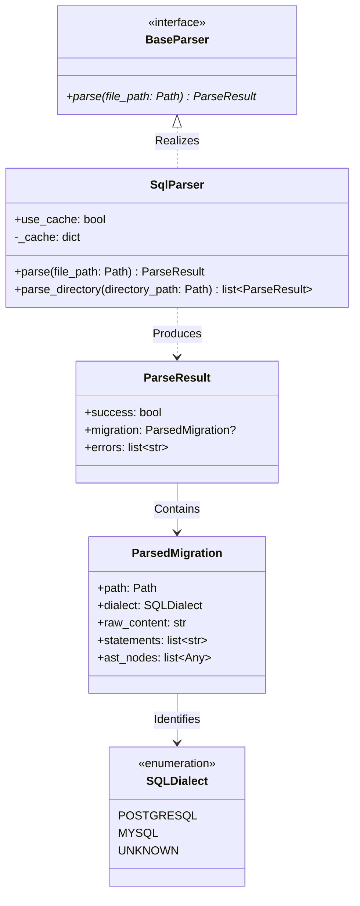
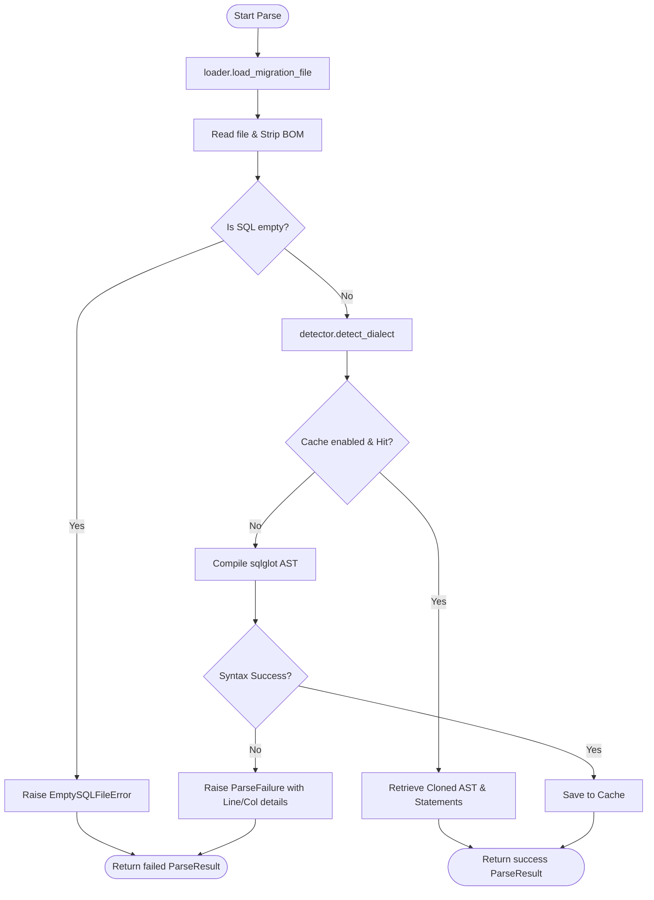

# Aegis Architecture Documentation

This document outlines the software design, structure, and pipeline components of the **Aegis** SQL migration static analyzer.

---

## System Design Overview

Aegis is built upon the principles of **Clean Architecture** and **SOLID design patterns**. The codebase is structured to isolate raw SQL loading, parsing, syntax validation, and rule checking.

```
+-------------------------------------------------------------+
|                       CLI Layer                             |
+------------------------------+------------------------------+
                               |
                               v
+------------------------------+------------------------------+
|                     Configuration System                     |
+------------------------------+------------------------------+
                               |
                               v
+------------------------------+------------------------------+
|                     static analyzer (Rules)                 |
+------------------------------+------------------------------+
                               |
                               v
+------------------------------+------------------------------+
|                         Parser Core                         |
+-------------------------------------------------------------+
```

---

## Parser Architecture Diagrams

### 1. Module Relationships (Mermaid Class Diagram)



### 2. Processing Pipeline Flowchart



---

## SOLID Compliance in Parser Core

Aegis enforces SOLID principles to ensure the static analyzer parser remains extensible, modular, and maintainable:

### 1. Single Responsibility Principle (SRP)
Each module in the parser package has a single focused responsibility:
- **`discovery.py`**: Resolving directories and identifying `.sql` paths while preventing circular loops.
- **`loader.py`**: Managing file encodings, stripping BOM bytes, and validating that the file contains executable content.
- **`detector.py`**: Scanning content signatures and directory path hints to match targeted SQL dialects.
- **`core.py`**: Orchestrating the parsing operations and running `sqlglot` compilers.

### 2. Open/Closed Principle (OCP)
The parser system is designed to allow extensions without modifying existing logic. The parser returns a list of generic `sqlglot` `Expression` AST nodes. When new SQL dialects are supported, we can extend `SQLDialect` and add detection heuristics without modifying the core `SqlParser` loop.

### 3. Liskov Substitution Principle (LSP)
The `SqlParser` realizes the `BaseParser` interface contract. Any subsystem requiring parsing relies on the `BaseParser` type, permitting the introduction of mock parsers or alternative SQL compilers without modifying consumer modules.

### 4. Interface Segregation Principle (ISP)
The `BaseParser` interface enforces only a single abstract signature: `parse(file_path: Path) -> ParseResult`. Clients are not forced to depend on directory traversal or caching options if they only require single-file compilation.

### 5. Dependency Inversion Principle (DIP)
High-level analyzer rules will depend on the `BaseParser` abstraction, rather than coupling directly to concrete `SqlParser` implementation details.

---

## Rule Engine & CLI Integration

As of `v0.3.0-alpha.1` and `v0.4.0-beta.1`, the **Rule Engine** and **CLI** are fully integrated:

1. **AST Node Traverser**: Inspects the SQL AST compile tree nodes (e.g. `exp.Alter`, `exp.Drop`) against rules.
2. **Context Evaluator**: Validates operations against `AegisConfig` rules (e.g. `allow_drop_table`, `allow_drop_column`, `allow_rename_table`).
3. **CLI Executor**: `aegis lint` invokes the engine and formats diagnostics with Rich. `aegis explain` shows rule documentations in standard details.
